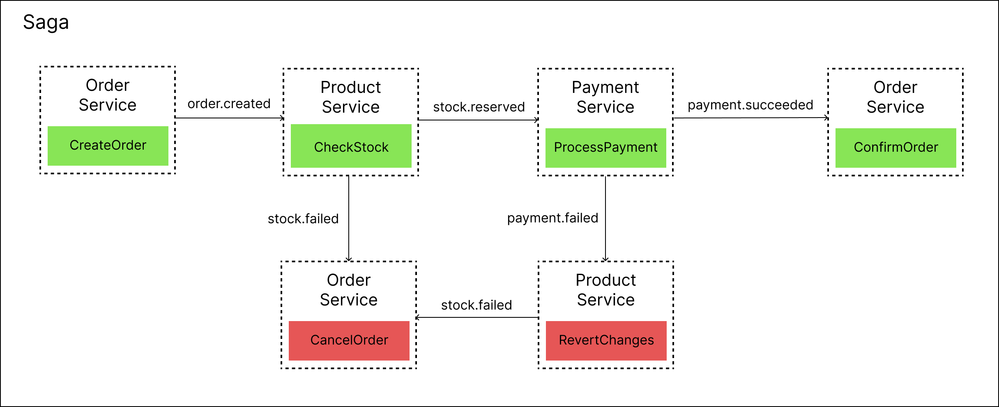

# Scalable E-Commerce Platform

A modern, distributed e-commerce platform built with microservices architecture to provide scalability, resilience, and maintainability.

## Architecture Overview

This platform is designed as a collection of loosely coupled microservices that communicate via both synchronous (gRPC) and asynchronous (Kafka) methods. Each service is responsible for a specific business capability and can be developed, deployed, and scaled independently.

## Technology Stack

### Backend
- **Programming Language**: Go
- **API Communication**: gRPC with Protocol Buffers
- **Event Streaming**: Apache Kafka
- **Databases**:
  - PostgreSQL (users, orders, payments)
  - MongoDB (product catalog)
  - Redis (shopping cart)
  - Elasticsearch (product search)
- **Authentication**: JWT

### Frontend
- **Programming Language**: JavaScript
- **Payment Processing**: Stripe API integration

### Infrastructure
- **Containerization**: Docker
- **Orchestration**: Kubernetes
- **API Gateway**: Kong
- **Email Service**: SendGrid

## Microservices

### User Service
- User registration and authentication
- Profile management
- JWT token generation and validation

### Product Catalog Service
- Product inventory management
- Search functionality using Elasticsearch
- Stock management

### Shopping Cart Service
- Cart operations (add, update, remove items)
- Redis-based temporary storage
- Cart expiration handling

### Order Service
- Order creation and management
- Integration with cart and payment services
- Order status tracking

### Payment Service
- Payment processing via Stripe
- Transaction management
- Payment status reporting

### Notification Service
- Email notifications using SendGrid
- Order confirmation emails
- User registration notifications
- Template-based email rendering

## SAGA Pattern Implementation

The platform implements the Choreography-based SAGA pattern for distributed transactions, particularly for the order creation process:



1. **Order Creation**:
   - User initiates an order
   - Order Service creates a pending order
   - Order Service clears the cart

2. **Stock Verification**:
   - Product Service checks and reserves stock
   - If successful, emits stock.reserved event
   - If unsuccessful, emits stock.reservation.failed event

3. **Payment Processing**:
   - Payment Service processes payment (Stripe or cash on delivery)
   - If successful, emits payment.succeeded event
   - If unsuccessful, emits payment.failed event

4. **Order Finalization**:
   - Order Service confirms the order
   - Notification Service sends confirmation email

5. **Compensation Actions**:
   - In case of failure at any step, compensation events trigger:
     - Restock products if payment fails
     - Refund payment if order cannot be completed

## Project Structure
```
e-commerce-platform/ 
├── user-service/
├── product-service/
├── shopping-cart-service/
├── order-service/
├── payment-service/
├── notification-service/
├── gateway/
├── frontend/
└── k8s/
```

Each service follows a similar internal structure:

```
service-name/
├── cmd/app/ # Application entry point
├── internal/ # Service implementation
│ ├── config/ # Configuration
│ ├── model/ # Domain models
│ ├── repository/ # Data access
│ ├── server/ # gRPC server
│ └── service/ # Business logic
├── migrations/ # Database migrations
├── protobuf/ # gRPC service definitions 
└── Dockerfile # Container definition
```

## Running the Application

### Prerequisites
- Docker and Docker Compose
- Go 1.24+
- Kafka
- PostgreSQL
- MongoDB
- Redis
- Elasticsearch

### Development Setup

1. Clone the repository:
```bash
git clone https://github.com/yourusername/e-commerce-platform.git
cd e-commerce-platform
```

2. Set up environment variables:
```bash
cp .env.example .env
# Edit .env with your configurations
```

3. Start infrastructure services
```bash
docker-compose up -d kafka postgres mongodb redis elasticsearch
```

4. Start the microservices:
```bash
docker-compose up -d
```

### Production Deployment
For production deployment, Kubernetes manifests are provided in the k8s directory:
```bash
kubectl apply -f k8s/
```

## Future Improvements

- Add frontend
- Add comprehensive test coverage (unit, integration, e2e)
- Implement API versioning
- Add distributed tracing with Jaeger
- Add centralized logging with ELK stack
- Implement circuit breakers for improved resilience
- Add performance monitoring
- Enhance security measures (API rate limiting, enhanced authentication)